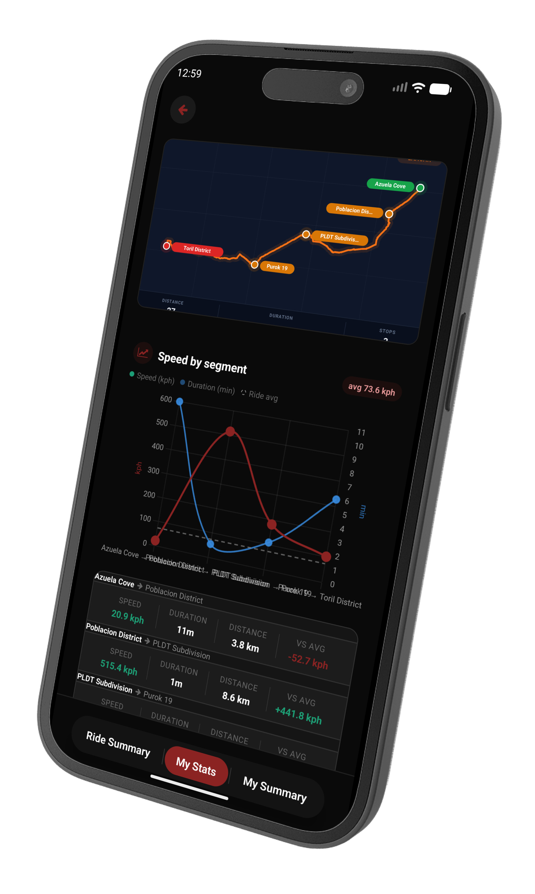
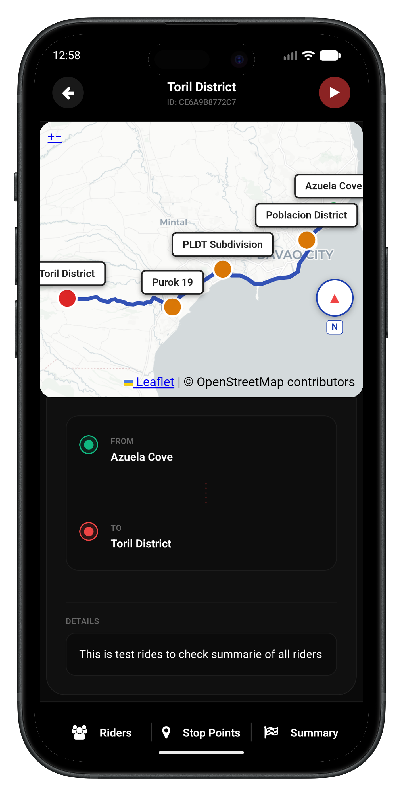
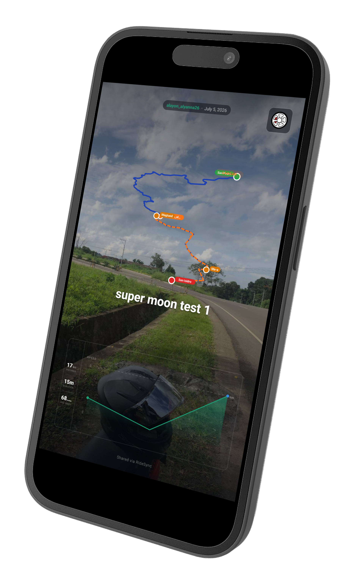

<div align="center">

# 🏍 Laagan

**Real-Time Group Ride Coordination for Riders**

Create a ride. Bring your crew. Stay connected — live location, checkpoints, and ride summaries, all in one app.

[](https://www.oracle.com/java/)
[](https://spring.io/projects/spring-boot)
[](https://reactnative.dev/)
[](https://www.postgresql.org/)
[](https://supabase.com/)
[](https://redis.io/)
[](https://www.docker.com/)
[]()

[Homepage](https://www.leanpaninsoro.dev/laagan/homepage/) · [Google Play Store](https://play.google.com/store/apps/details?id=com.laagan)

</div>

---

##  Table of Contents

1. [Project Overview](#-project-overview)
2. [Key Features](#-key-features)
3. [Technology Stack](#-technology-stack)
4. [System Architecture](#-system-architecture)
5. [Application Screenshots](#-application-screenshots)
6. [Installation and Setup](#-installation-and-setup)
7. [Environment Variables](#-environment-variables)
8. [Project Structure](#-project-structure)
9. [API Overview](#-api-overview)
10. [Database Overview](#-database-overview)
11. [Security Features](#-security-features)
12. [Future Improvements](#-future-improvements)
13. [Contributing](#-contributing)
14. [License](#-license)
15. [Contact Information](#-contact-information)

---

##  Project Overview

**Laagan** is a real-time group ride coordination platform built for motorcyclists in Mindanao, Philippines. It solves a simple but persistent problem for group rides: staying connected. Instead of a chaotic group chat full of "where are you?" messages, Laagan gives every rider a live map, automatic checkpoint tracking, and a shareable ride summary once the ride is done.

A rider creates a group or solo ride, invites others via a QR code or shareable link, and the app takes care of the rest — live location broadcasting, automatic arrival detection at stops, per-rider route deviation and rerouting, and a permanent record of the ride once everyone finishes.

The backend is a Spring Boot REST API. The mobile app is built with React Native and is **live on the Google Play Store**, currently in closed testing on Android.

> Personal project — sole developer, full-stack (backend lead), built by a developer from Davao City.

---

## ✨ Key Features

- **Live Location Sharing** — Every rider's position streams to the group in real time over Server-Sent Events (SSE), so no one has to ask "where are you?"
- **Group & Solo Rides** — Create a ride for your crew or ride solo; join via invite link or QR code.
- **Automatic Checkpoint Tracking** — Starting point, stop points, and ending point arrivals are detected automatically from GPS proximity — no manual check-in required.
- **Smart Rerouting** — If a rider strays off the planned route, the backend detects the deviation and requests a personal reroute from GraphHopper, without disrupting the shared group route.
- **Ride Summaries** — Duration, total distance, average speed, and per-checkpoint splits (Strava-style "laps"), generated automatically when a ride finishes — both personally and as a group.
- **QR & Link Invites** — Every ride gets an auto-generated, expiring invite with a QR code and shareable link.
- **Multi-Method Authentication** — Email/password (with email verification), Google Sign-In, and Facebook Login, all issuing the same stateless JWT session.
- **Mindanao-Aware Geocoding** — A custom pipeline matches Nominatim reverse-geocoding results against the official PSGC (Philippine Standard Geographic Code) dataset for accurate barangay-level place names — no paid geocoding API required.
- **Ride Snapshots** — Riders can attach a photo to their finished ride, hosted on Cloudinary.
- **Abuse Protection** — Redis-backed rate limiting and account lockout on login/registration, with graceful degradation if Redis is temporarily unavailable.

---

## Technology Stack

| Layer | Technology |
|---|---|
| **Mobile Frontend** | React Native |
| **Backend** | Spring Boot 3 (Java 17) |
| **Database** | PostgreSQL + PostGIS (hosted on Supabase) |
| **ORM** | Spring Data JPA + Hibernate Spatial (JTS geometry) |
| **Migrations** | Flyway |
| **Authentication** | Spring Security + JWT, Google Sign-In, Facebook Login |
| **Caching / Rate Limiting** | Redis (Lettuce) + Resilience4j |
| **Real-Time Updates** | Server-Sent Events (SSE) |
| **Routing** | GraphHopper API |
| **Geocoding** | Nominatim API + PSGC dataset |
| **Location Imagery** | Wikimedia Commons API |
| **Image Hosting** | Cloudinary |
| **Transactional Email** | Brevo |
| **QR Codes** | ZXing |
| **Containerization** | Docker (multi-stage build) |

---

##  System Architecture

The backend follows a clean layered architecture:

```
Model (JPA Entities)
   ↓
Repository (Spring Data JPA)
   ↓
Service (Business Logic)
   ↓
Utility (Shared Domain Logic)
   ↓
DTO (Request / Response Contracts)
   ↓
Controller (REST Endpoints)
```

Two cross-cutting layers support this stack:
- **Config** — Security, JWT, Redis, async task execution, Cloudinary, and rate limiting.
- **Global Exception Handling** — a single `@RestControllerAdvice` converts every domain exception into a consistent JSON error response.

**High-level flow:**

1. **Authenticate** → password, Google, or Facebook login issues a JWT access token and a rotating refresh token.
2. **Create a ride** → the backend resolves place names and route geometry concurrently (parallel calls to Nominatim + GraphHopper), then persists the ride and generates a QR invite.
3. **Join a ride** → via invite token/QR or a direct join request, subject to creator approval.
4. **Start the ride** → converts it into a live session; every participant's location streams over SSE.
5. **Track progress** → checkpoint arrivals are auto-detected; off-route riders get a personal reroute.
6. **Finish the ride** → each rider's personal summary is recorded on arrival; once everyone's done (or the creator force-finishes), a permanent group summary is created.

---

##  Application Screenshots

| Graph | Ride View | Snapshot |
|:---:|:---:|:---:|
|  |  |  |
---

##  Installation and Setup

### Backend

**Prerequisites**
- Java 17+
- Maven
- PostgreSQL with the PostGIS extension (or a [Supabase](https://supabase.com/) project)
- Redis instance
- Docker (optional, for containerized runs)

**Steps**

```bash
# 1. Clone the repository
git clone https://github.com/<your-username>/laagan-backend.git
cd laagan-backend

# 2. Configure environment variables
cp .env.example .env
# then edit .env with your own credentials (see Environment Variables section below)

# 3. Build the project
./mvnw clean install

# 4. Run database migrations (handled automatically by Flyway on startup)

# 5. Run the application
./mvnw spring-boot:run
```

**Or run with Docker:**

```bash
docker build -t laagan-backend .
docker run --env-file .env -p 8080:8080 laagan-backend
```

The API will be available at `http://localhost:8080`.

### Frontend (React Native)

```bash
# go to directory of frontend

# 1. Install dependencies
npm install
# or
yarn install

# 3. Point the app at your backend
# Update the API base URL in the app's environment/config file to your backend URL

# 4. Run on Android
npx react-native run-android

# 5. Run on iOS (requires macOS + Xcode)
npx react-native run-ios
```

> The production build is available directly on the [Google Play Store](https://play.google.com/store/apps/details?id=com.laagan).

---

## Environment Variables

The backend is fully configured via environment variables — no credentials are committed to source. Copy `.env.example` and fill in your own values.

| Variable | Description |
|---|---|
| `DATABASE_URL` / DB credentials | PostgreSQL (Supabase) connection details |
| `JWT_SECRET` | Signing secret for access tokens (minimum 256-bit, validated at startup) |
| `spring.data.redis.host` / `port` / `password` | Redis connection details |
| `GRASS_HOPPER` | GraphHopper API key (route directions) |
| `NOMINATIM_API_BASE` | Nominatim geocoding API base URL |
| `USER_AGENT` | User-Agent header required by Nominatim's usage policy |
| `cloudinary.cloud_name` / `api_key` / `api_secret` | Cloudinary image hosting credentials |
| `brevo.api-key` | Brevo transactional email API key |
| `google.client-id` | Google OAuth client ID (ID token verification) |
| `FACEBOOK_CLIENT_ID` / `FACEBOOK_APP_SECRET` | Facebook Graph API credentials |
| `baseurl` | Public base URL used to build invite links |
| `app.registration.max-users` | Global cap on total registered users |
| `graphhopper.quota.daily-limit` | Daily GraphHopper credit budget guard |

> See `.env.example` in the repository root for the full list of variables and their expected format.

---

## 🔌 API Overview

The API is organized around five core domains. All endpoints are prefixed as shown; authenticated endpoints require a `Bearer` JWT access token.

| Domain | Example Endpoints |
|---|---|
| **Authentication** | `POST /riders/login`, `POST /riders/register`, `POST /riders/refresh`, `POST /riders/google-login`, `POST /riders/facebook-login` |
| **Rides** | `POST /riders/create`, `PUT /riders/{id}`, `GET /riders/feed`, `GET /status/{id}` |
| **Live Tracking** | `POST /start/{id}`, `POST /update/{startedRideId}`, `GET /location/{startedRideId}/stream` (SSE) |
| **Invites & Join Requests** | `GET /invite-request/{id}/qr-url`, `POST /join-request/{token}`, `PUT /join-request/approve/{joinId}` |
| **Finished Rides** | `POST /ride/finished/{id}`, `GET /ride/{id}/summary`, `GET /view/{id}/detail` |

>  A full endpoint index with methods, auth requirements, and descriptions is maintained in the project's internal technical documentation.

---

##  Database Overview

PostgreSQL with the **PostGIS** extension, hosted on **Supabase**, with the schema managed entirely through versioned Flyway migrations. Spatial data (rider locations, ride start/end/stop points) uses PostGIS `Point` geometry, mapped through Hibernate Spatial to JTS types.

**Core table groups:**
- **Identity & Auth** — `rider`, `rider_profile`, `refresh_tokens`, `google_account`, `facebook_account`, `email_verification_token`
- **Ride Definition** — `event_rides`, `ride_stop_points`, `ride_participants`
- **Active Ride Tracking** — `started_rides`, `rider_locations`, `participant_location`, `ride_checkpoint_arrivals`, `ride_status_entries`
- **Ride Completion** — `finished_rides`, `personal_finished_rides`, `finished_ride_participants`
- **Invitations** — `invite_requests`, `join_requests`, `ride_join_requests`
- **Reference Data** — `psgc_data` (official PH geographic codes), `rider_type` (motorcycle models)

Row-Level Security is enabled on the `rider` table, restricting visibility to active (`enabled = true`) accounts.

---

## Security Features

- **Stateless JWT authentication** (HS256), with per-token revocation via a Redis-backed blacklist
- **Rotating refresh tokens** — stored only as SHA-256 hashes; reuse of a revoked token outside a short grace window triggers full revocation of that rider's entire token family (theft-response behavior)
- **BCrypt password hashing**
- **Redis-backed rate limiting and account lockout** on login and registration, both IP-based and account-based, with graceful fail-open degradation if Redis is temporarily unavailable
- **Email verification** required before password-based accounts can log in
- **Resilience4j rate limiters** on all outbound third-party API calls (Nominatim, GraphHopper, Wikimedia)
- **Method- and path-level authorization** via Spring Security, with ride-ownership checks enforced in the service layer (e.g., only a ride's creator can edit, delete, or force-finish it)
- **Startup-time secret validation** — the JWT signing secret is rejected if too short, low-entropy, or a known weak value

---
##  Contributing

Laagan is currently a personal, single-developer project. Suggestions, bug reports, and ideas are welcome — feel free to open an issue or reach out directly via email.

If you'd like to contribute code, please open an issue first to discuss the change before submitting a pull request.

---

##  Contact Information

**Developer:** Lean Paninsoro
**Location:** Davao City, Philippines
**Email:** [paninsorolean@gmail.com](mailto:paninsorolean@gmail.com)
**Project Homepage:** [leanpaninsoro.dev/laagan/homepage](https://www.leanpaninsoro.dev/laagan/homepage/)
**Google Play Store:** [Laagan on Google Play](https://play.google.com/store/apps/details?id=com.laagan)

---

<div align="center">

Built with ❤️ by a rider, for riders — from Davao City.

</div>